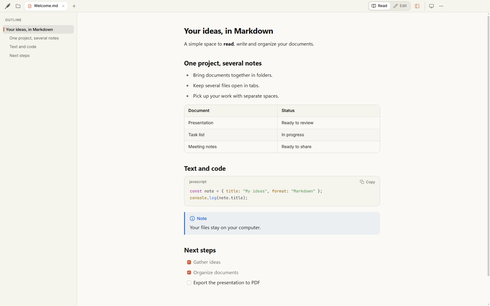
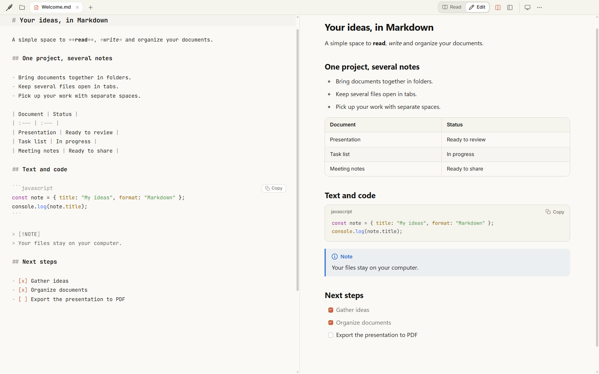
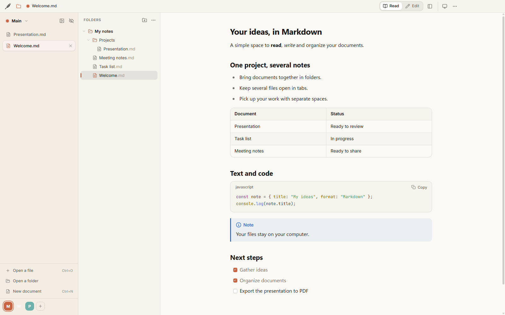
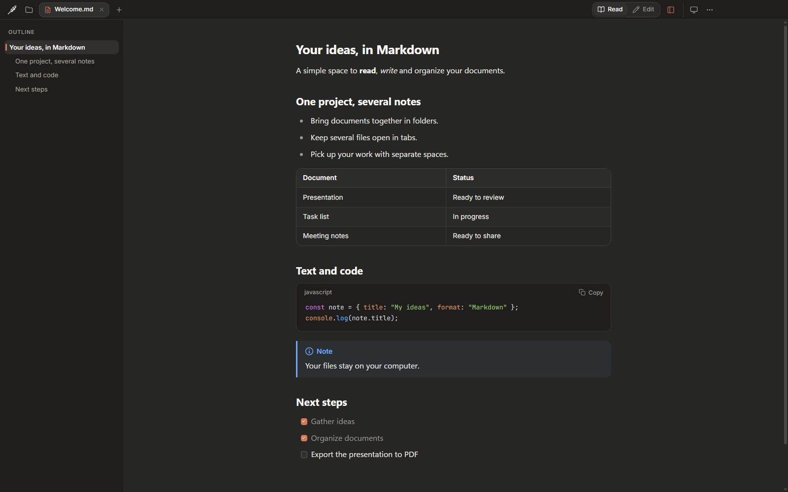

# Folio

A calm place to read, write and organize Markdown on Windows and Linux.

Open a note, give it room to breathe, and switch to editing when an idea comes. Keep your folders, tabs and projects together, with a live preview and a look that feels like yours.

**Free · Open source · MIT · Works offline**

[Download](#install) · [Build from source](#build-from-source) · [Contribute](CONTRIBUTING.md) · [Report a bug](https://github.com/myrvmsr/folio/issues)



---

## Why

Markdown is a lovely format for notes, documentation and ideas. Folio gives those files a comfortable place to live: readable typography, a quiet interface, and the tools you need to move between reading, writing and organizing.

Your documents stay in the folders you choose. No Folio account, no subscription, no special file format. Open the same files in another editor whenever you like.

Folio is open source under the MIT License. Read the code, build it yourself, change it, or help make it better.

## Features

- 📖 **Read comfortably** — clear typography, an outline that follows your reading, foldable sections and search that ignores accents.
- ✍️ **Edit with a live preview** — Markdown on one side, the result on the other. Hide the preview when you want more room to write. Includes find and replace, formatting shortcuts and an optional spell checker.
- 💾 **Save as you go** — auto save after a change, at a regular interval, or when switching tabs or windows. Manual saving is available too.
- 📂 **Keep your folders close** — add several folders, create documents and subfolders, rename, move by drag and drop, or send files to the system trash. Open tabs follow renamed and moved files.
- 🗂️ **Make room for each project** — horizontal or vertical tabs, named spaces with their own colors, and session restoration when you return.
- 🧮 **More than plain text** — highlighted code with a Copy button, tables, math formulas, Mermaid diagrams, clickable task lists, callouts, footnotes and YAML properties.
- 🔄 **Stay in sync with your files** — Folio watches for changes from other apps and asks what to do when they conflict with your unsaved edits.
- 🎨 **Make it yours** — light, dark or automatic theme; custom accent, background and text colors; font, text size and reading width.
- ⌨️ **Shortcuts that fit your keyboard** — customizable combinations, conflict detection and support for AZERTY layouts.
- 📄 **Share a finished document** — export to PDF or print on a white background.
- 🌍 **Seven languages** — English, français, español, Deutsch, Nederlands, italiano and português. Folio follows your system language; you can change it in Settings.
- 🔒 **Local by default** — no ads, usage analytics or document sync service. Read and edit documents with local resources offline. Remote images and spell-check dictionaries may use the network; see the [privacy policy](PRIVACY.md).



<details>
<summary>See folders and dark mode</summary>





</details>

## Versions

The latest downloadable release is [Folio 1.3.0](https://github.com/myrvmsr/folio/releases/tag/v1.3.0), published on October 6, 2026. It adds Linux packages, file-manager integration and correct handling of case-sensitive file names.

See [Releases](https://github.com/myrvmsr/folio/releases) for downloads and release notes. Source changes may be newer than the published installers.

## Install

| Your system | Download |
| --- | --- |
| Windows 10 / 11, x64 | [Folio-Setup.exe](https://github.com/myrvmsr/folio/releases/latest/download/Folio-Setup.exe) |
| Ubuntu / Debian, x64 | [Folio-Linux-x64.deb](https://github.com/myrvmsr/folio/releases/latest/download/Folio-Linux-x64.deb) |
| Linux, x64 | [Folio-Linux-x64.AppImage](https://github.com/myrvmsr/folio/releases/latest/download/Folio-Linux-x64.AppImage) |

The Linux packages are tested on Ubuntu 24.04. Optional SHA-256 checks are in the collapsed verification section of the [release notes](https://github.com/myrvmsr/folio/releases/latest).

### Windows

Run `Folio-Setup.exe`. Folio installs for your user account without administrator rights, adds shortcuts and opens.

The installer is not digitally signed. If SmartScreen shows “Windows protected your PC”, use **More info → Run anyway**. Windows 11 **Smart App Control** may block it without that option; the current GitHub installer cannot be used on those PCs.

To open Markdown files with a double click, right-click a `.md` file and choose **Open with → Choose another app → Folio → Always**.

### Linux

Ubuntu / Debian:

```bash
sudo apt install ./Folio-Linux-x64.deb
```

AppImage:

```bash
chmod +x Folio-Linux-x64.AppImage
./Folio-Linux-x64.AppImage
```

If your system cannot mount the AppImage, run `APPIMAGE_EXTRACT_AND_RUN=1 ./Folio-Linux-x64.AppImage`. The `.deb` package adds Folio to your applications menu; use your file manager's **Open with** menu to associate `.md` files.

### Update or uninstall

Folio's GitHub builds do not update automatically. Close the app, download the latest package and install it over the previous version, or replace your AppImage. Your documents and settings are kept. Find your version in **⋯ → About Folio**.

To uninstall, use **Windows Settings → Apps → Folio → Uninstall**, run `sudo apt remove folio-markdown` for the `.deb`, or delete the AppImage.

### Build from source

Requirements: **Node.js 24 LTS**, npm, and a Windows or Linux desktop environment.

```bash
git clone https://github.com/myrvmsr/folio.git
cd folio
npm ci
npm start
```

To make an installer, run the command on its target system:

```bash
npm run dist:win      # Windows: release/Folio-Setup.exe
npm run dist:linux    # Linux: release/Folio-Linux-x64.AppImage and .deb
```

Linux development and tests need Electron's system libraries and sandbox setup. The [build workflow](.github/workflows/build.yml) lists the Ubuntu dependencies and setup; [CONTRIBUTING.md](CONTRIBUTING.md) covers development and checks.

## Things to try

| Do this | Folio does that |
| --- | --- |
| Drop a Markdown file onto the window | Opens it in a tab |
| Press `Ctrl+E` | Switches between reading and editing |
| Press `Ctrl+Shift+P` while editing | Shows or hides the live preview |
| Click a task-list checkbox | Updates the Markdown file |
| Press `Ctrl+Shift+D` | Opens the Folders panel |
| Add a space in the vertical tabs panel | Gives a project its own name, color and tabs |
| Press `Ctrl+Shift+E` | Exports the current document to PDF |
| Press `F1` | Opens the keyboard shortcut settings |

Try the [example document](exemples/Bienvenue%20dans%20Folio.md) for formulas, diagrams, code and task lists. A [detailed user guide in French](docs/USER_GUIDE.fr.md) covers settings, folders, spaces and auto save.

## How it works

Folio is an Electron desktop app written in JavaScript and CSS. The main process handles files, folder watching, system integration and PDF export. The interface renders Markdown with markdown-it, sanitizes HTML with DOMPurify, displays formulas with KaTeX and diagrams with Mermaid, and uses CodeMirror for editing.

Fonts, rendering libraries and diagram support are bundled with the app. Documents remain ordinary files on disk; settings and session information are stored locally in your user profile.

## Contributing

Bug reports, fixes, translations and ideas are welcome. Start with [CONTRIBUTING.md](CONTRIBUTING.md), or open an [issue](https://github.com/myrvmsr/folio/issues/new/choose). Please follow the [code of conduct](CODE_OF_CONDUCT.md), and report security problems privately as described in the [security policy](SECURITY.md).

Want to improve a translation? The language files are in `src/shared/locales/`. Run `npm run check-locales` after your changes. See [TESTING.md](TESTING.md) for the logic tests and interface scenarios.

## Credits

Built by [myrvmsr](https://github.com/myrvmsr). Folio uses open-source libraries and the Source Serif 4, Inter and JetBrains Mono fonts; see [third-party credits and notices](THIRD-PARTY.md).

## License

Folio's original code, documentation and assets are available under the [MIT License](LICENSE). Use it, modify it and redistribute it while preserving the license and copyright notice. Third-party software and fonts retain their own licenses.

If Folio is useful to you, a star helps others find it.

[Releases](https://github.com/myrvmsr/folio/releases) · [Issues](https://github.com/myrvmsr/folio/issues) · [Privacy](PRIVACY.md) · [Security](SECURITY.md)
