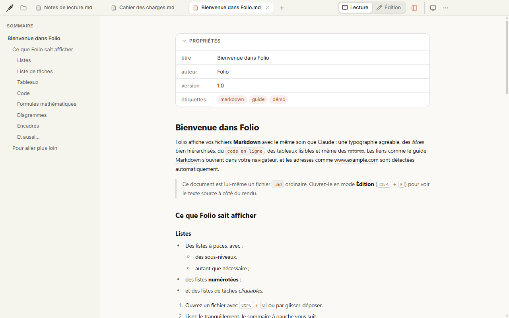
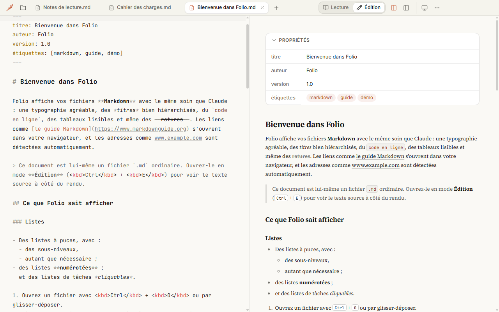
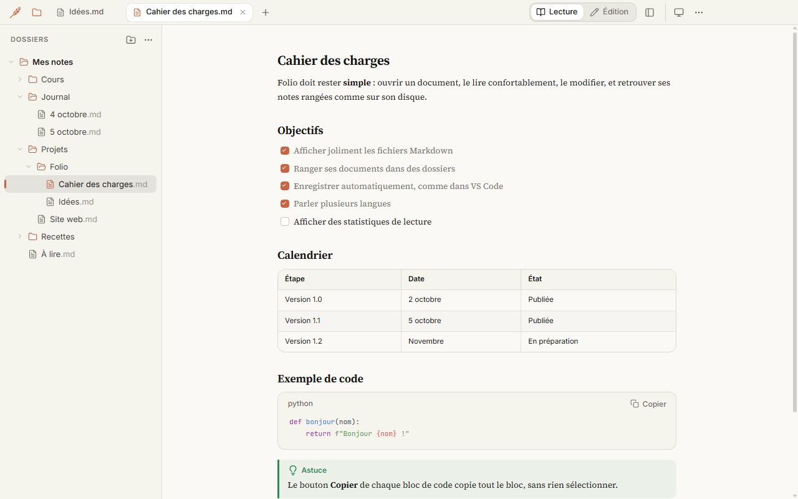
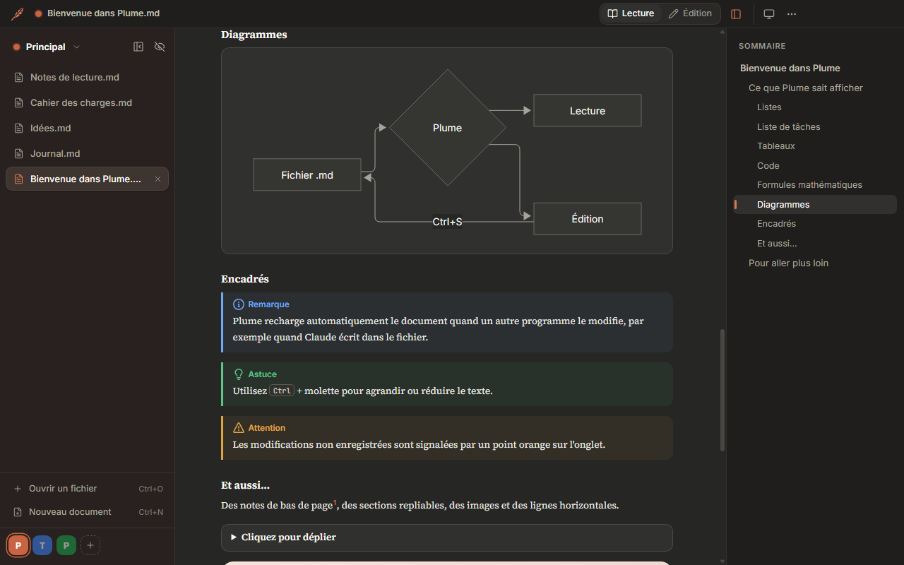
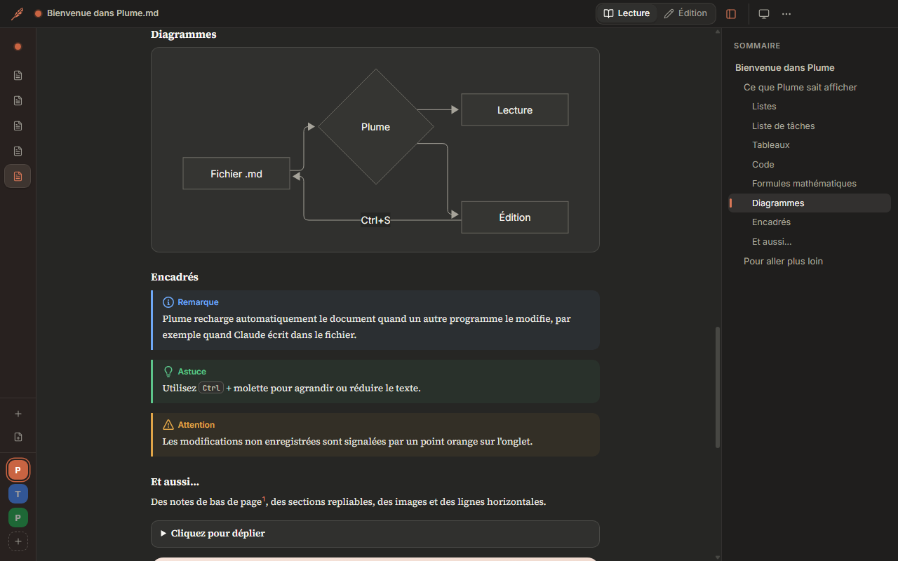
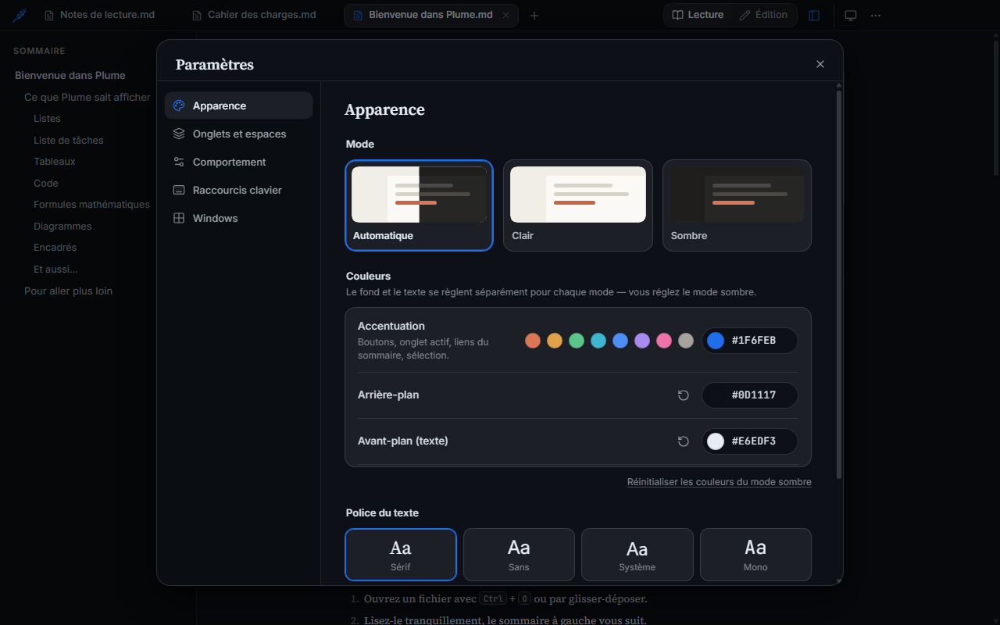

<p align="center">
  
</p>

<h1 align="center">Folio</h1>

<p align="center">
  A Markdown reader and editor for Windows and Linux.
</p>

<p align="center">
  <b>Free · works offline</b><br>
  <sub>French · English · Spanish · German · Dutch · Italian · Portuguese</sub>
</p>

| Your system | Download |
| --- | --- |
| Windows 10 or 11, 64-bit | [Windows installer](https://github.com/myrvmsr/folio/releases/latest/download/Folio-Setup.exe) |
| Ubuntu / Debian, 64-bit | [Linux .deb package](https://github.com/myrvmsr/folio/releases/latest/download/Folio-Linux-x64.deb) |
| Linux, 64-bit (portable) | [AppImage](https://github.com/myrvmsr/folio/releases/latest/download/Folio-Linux-x64.AppImage) |

Optional SHA-256 checks are in the collapsed verification section of the [release notes](https://github.com/myrvmsr/folio/releases/latest).

## What's new in 1.3

- **Linux support:** a `.deb` package for Ubuntu / Debian and a portable AppImage.
- Open Markdown files from your Linux file manager.
- On Linux, files such as `Note.md` and `note.md` are handled as separate files.

Already installed? See [Update](#update).

## Why Folio?

Folio keeps reading and editing Markdown simple. You can read your notes, manage your files and change the look in one app.

- **A clear view:** read your documents with simple menus and an outline to find each section.
- **Workspaces:** keep work, personal notes and projects in separate spaces, each with its own tabs.
- **Several folders:** open your notes folders together in one panel.
- **Your own look:** choose the font, text size, theme and colors that suit you.

Your files stay on your computer. You can work offline.

## Features

### Reading

- Headings, lists, quotes, tables, images and links.
- Code highlighting and a **Copy** button on code blocks.
- Math formulas and Mermaid diagrams.
- Task lists you can click, note and warning boxes, footnotes and sections you can fold.
- YAML information at the top of a file is shown in a **Properties** panel.
- An outline to jump to headings, and search that ignores accents.

<p align="center">
  
</p>

### Editing

- Edit the Markdown text next to a live preview. You can hide the preview.
- **Auto save:** save one second after a change, at a set time interval or when switching tabs or windows. You can also turn it off.
- Keyboard shortcuts for bold, italic, strikethrough, code and links.
- Find and replace, and an optional spell checker.

<p align="center">
  
</p>

### Folders

- Add several folders and browse their files in the **Folders** panel.
- Create files and folders, rename them, move them by drag and drop, or send them to the system trash.
- Open tabs follow files when you rename or move them.
- The panel updates when files change. Hidden folders such as `.git` and `.obsidian` stay out of the list.

<p align="center">
  
</p>

### Tabs

- Open several documents in tabs, at the top or on the left.
- Keep the left panel open, show only its icons, or hide it. A hidden panel appears when you move the mouse to the left edge.
- Switch tabs with the keyboard, reopen a closed tab, or close all other tabs.

<table>
  <tr>
    <td align="center"><br><sub>Expanded tabs</sub></td>
    <td align="center"><br><sub>Tabs as icons</sub></td>
  </tr>
</table>

### Workspaces

- Create **spaces**, each with its own name, color and tabs.
- Move a tab to another space, and switch spaces with a click or a shortcut.
- Folio can reopen your spaces and tabs when you start the app.

### Appearance

- Light, dark or automatic theme.
- Change the accent, background and text colors.
- Choose from four fonts: **Serif**, **Sans**, **System** and **Mono**.
- Change the text size and reading width, or use full screen.

<p align="center">
  
</p>

### Languages and shortcuts

- Seven languages: French, English, Spanish, German, Dutch, Italian and Portuguese.
- Folio uses your system language by default. Change it in **Settings › Language**.
- Change keyboard shortcuts in Settings with **F1**. Folio checks for conflicts and supports AZERTY keyboards.

### Files and export

- Open `.md` files with a double click, drag and drop, the Folders panel or the recent files list.
- Reload files when another app changes them. Folio asks what to do if you have unsaved changes.
- Web links open in your browser. Links to other Markdown files open in Folio.
- Copy the Markdown text or file path, or show a file in your file manager.
- Export to PDF or print on a white background.

## Installation

### Windows

1. Download **Folio-Setup.exe** from the table above. If your browser asks, choose **Keep**.
2. Run the file. If Windows shows “Windows protected your PC”, click **More info**, then **Run anyway**. This message appears because Folio is not digitally signed.
3. Folio installs for your user account, without administrator rights, and opens.

> [!NOTE]
> Windows 11 **Smart App Control** can block Folio without a “Run anyway” option. Folio does not currently work on those PCs.

To open `.md` files with a double click, right-click a `.md` file, then choose **Open with › Choose another app › Folio › Always**.

### Linux

**Ubuntu / Debian:** download the `.deb` file and open it with your software manager. You can also run this command from the download folder:

```bash
sudo apt install ./Folio-Linux-x64.deb
```

**Portable AppImage:** download the AppImage, allow it to run in the file properties, then open it. Or run:

```bash
chmod +x Folio-Linux-x64.AppImage
./Folio-Linux-x64.AppImage
```

If the AppImage cannot be mounted, try:

```bash
APPIMAGE_EXTRACT_AND_RUN=1 ./Folio-Linux-x64.AppImage
```

Linux downloads are for **64-bit x86 (x64)** computers and are tested on **Ubuntu 24.04**. Use **Open with** in your file manager to open `.md` files with Folio. The `.deb` package adds Folio to your applications menu.

### Update

Folio does not update automatically.

1. Close Folio.
2. Download the latest version for your system from the table above.
3. On Windows, run the installer. On Linux, install the new `.deb` or replace your AppImage.

Your settings, spaces, folders and documents are kept. Check your version in **⋯ › About Folio**.

### Uninstall

- **Windows:** **Settings › Apps › Installed apps › Folio › Uninstall**.
- **Linux .deb:** use your software manager or run `sudo apt remove folio-markdown`.
- **Linux AppImage:** delete the AppImage file.

## Default shortcuts

These shortcuts work on Windows and Linux. You can change them in Settings with **F1**.

| Action | Shortcut |
| --- | --- |
| Open a file / new document | <kbd>Ctrl</kbd>+<kbd>O</kbd> / <kbd>Ctrl</kbd>+<kbd>N</kbd> |
| Save | <kbd>Ctrl</kbd>+<kbd>S</kbd> |
| Switch between reading and editing | <kbd>Ctrl</kbd>+<kbd>E</kbd> |
| Show or hide the editing preview | <kbd>Ctrl</kbd>+<kbd>Shift</kbd>+<kbd>P</kbd> |
| Find | <kbd>Ctrl</kbd>+<kbd>F</kbd> |
| Outline | <kbd>Ctrl</kbd>+<kbd>Shift</kbd>+<kbd>O</kbd> |
| Folders panel | <kbd>Ctrl</kbd>+<kbd>Shift</kbd>+<kbd>D</kbd> |
| Next tab / tab 1 to 9 | <kbd>Ctrl</kbd>+<kbd>Tab</kbd> / <kbd>Ctrl</kbd>+<kbd>1</kbd>…<kbd>9</kbd> |
| Reopen a closed tab | <kbd>Ctrl</kbd>+<kbd>Shift</kbd>+<kbd>T</kbd> |
| Collapse or expand vertical tabs | <kbd>Ctrl</kbd>+<kbd>Shift</kbd>+<kbd>B</kbd> |
| Hide or show the tab panel | <kbd>Ctrl</kbd>+<kbd>Shift</kbd>+<kbd>M</kbd> |
| Next / previous space | <kbd>Ctrl</kbd>+<kbd>Shift</kbd>+<kbd>Page Down</kbd> / <kbd>Ctrl</kbd>+<kbd>Shift</kbd>+<kbd>Page Up</kbd> |
| Export PDF / print | <kbd>Ctrl</kbd>+<kbd>Shift</kbd>+<kbd>E</kbd> / <kbd>Ctrl</kbd>+<kbd>P</kbd> |
| Full screen | <kbd>F11</kbd> |
| Settings | <kbd>Ctrl</kbd>+<kbd>,</kbd> |
| Keyboard shortcuts | <kbd>F1</kbd> |

---

<sub>Folio uses open-source software (Electron, markdown-it, KaTeX, Mermaid, CodeMirror, highlight.js) and the Source Serif 4, Inter and JetBrains Mono fonts. Their licenses are included in <code>THIRD-PARTY-NOTICES.txt</code> in the Folio installation folder.</sub>
