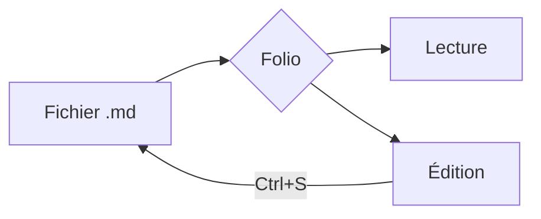

# Bienvenue dans Folio

Folio affiche vos fichiers **Markdown** avec le même soin que Claude : une typographie agréable, des *titres* bien hiérarchisés, du `code en ligne`, des tableaux lisibles et même des ~~ratures~~. Les liens comme [le guide Markdown](https://www.markdownguide.org) s'ouvrent dans votre navigateur, et les adresses comme www.example.com sont détectées automatiquement.

> Ce document est lui-même un fichier `.md` ordinaire. Ouvrez-le en mode **Édition** (<kbd>Ctrl</kbd> + <kbd>E</kbd>) pour voir le texte source à côté du rendu.

## Ce que Folio sait afficher

### Listes

- Des listes à puces, avec :
  - des sous-niveaux,
  - autant que nécessaire ;
- des listes **numérotées** ;
- et des listes de tâches *cliquables*.

1. Ouvrez un fichier avec <kbd>Ctrl</kbd> + <kbd>O</kbd> ou par glisser-déposer.
2. Lisez-le tranquillement, le sommaire à gauche vous suit.
3. Modifiez-le si besoin, puis enregistrez avec <kbd>Ctrl</kbd> + <kbd>S</kbd>.

### Liste de tâches

- [x] Installer Folio
- [x] Ouvrir un premier document
- [ ] Définir Folio comme application par défaut pour les `.md`
- [ ] Cocher cette case pour voir le fichier se mettre à jour

### Tableaux

| Fonction | Raccourci | Disponible |
| :-- | :-: | --: |
| Ouvrir un fichier | <kbd>Ctrl</kbd> + <kbd>O</kbd> | ✅ |
| Rechercher dans le document | <kbd>Ctrl</kbd> + <kbd>F</kbd> | ✅ |
| Basculer en édition | <kbd>Ctrl</kbd> + <kbd>E</kbd> | ✅ |
| Exporter en PDF | <kbd>Ctrl</kbd> + <kbd>Maj</kbd> + <kbd>E</kbd> | ✅ |

### Code

Les blocs de code sont colorés et possèdent un bouton **Copier** :

```python
def fibonacci(n: int) -> list[int]:
    """Renvoie les n premiers termes de la suite de Fibonacci."""
    suite = [0, 1]
    while len(suite) < n:
        suite.append(suite[-1] + suite[-2])
    return suite[:n]

print(fibonacci(10))  # [0, 1, 1, 2, 3, 5, 8, 13, 21, 34]
```

```javascript
const salutation = (prenom) => `Bonjour ${prenom} !`;
document.querySelector('#titre').textContent = salutation('Claude');
```

```
Un bloc sans langage précisé reste en texte brut.
```

### Formules mathématiques

La célèbre identité d'Euler s'écrit $e^{i\pi} + 1 = 0$, et la formule de résolution d'une équation du second degré :

$$
x = \frac{-b \pm \sqrt{b^2 - 4ac}}{2a}
$$

### Diagrammes



### Encadrés

> [!NOTE]
> Folio recharge automatiquement le document quand un autre programme le modifie, par exemple quand Claude écrit dans le fichier.

> [!TIP]
> Utilisez <kbd>Ctrl</kbd> + molette pour agrandir ou réduire le texte.

> [!WARNING]
> Les modifications non enregistrées sont signalées par un point orange sur l'onglet.

### Et aussi…

Des notes de bas de page[^1], des sections repliables, des images et des lignes horizontales.

<details>
<summary>Cliquez pour déplier</summary>

Ce contenu était caché. Le Markdown à l'intérieur fonctionne aussi : **gras**, `code`, [liens](#bienvenue-dans-folio).

</details>


---

## Pour aller plus loin

Consultez le menu **⋯** en haut à droite pour l'export PDF, l'impression et les paramètres (thème clair ou sombre, police, largeur du texte…). La touche <kbd>F1</kbd> affiche tous les raccourcis clavier.

[^1]: Comme celle-ci, qui apparaît en bas du document.
